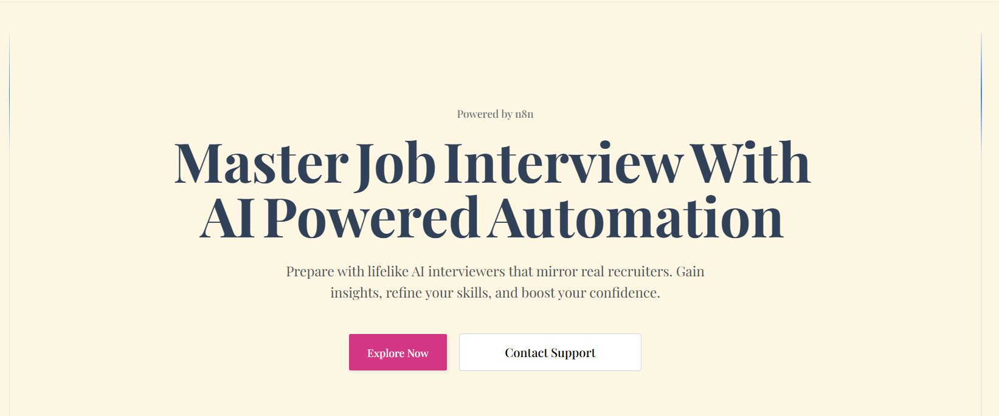

# HireWise - AI Interviews. Real Market Data. Unstoppable Preparation.



> **🏆 n8n + Bright Data**  
> An AI-powered interview preparation platform that combines real-time job market intelligence with lifelike AI interviews.

## 🚀 Live Demo

- **🌐 Live Application**: [https://hirewise-delta.vercel.app/](https://hirewise-delta.vercel.app/)
- **📋 GitHub Repository**: [https://github.com/Arjunhg/hirewise](https://github.com/Arjunhg/hirewise)
- **⚙️ n8n Workflow JSON**: [GitHub Gist](https://gist.github.com/Arjunhg/2a62ca089cf4f1b3049c7284d77525ec)

## 🎯 What HireWise Does

HireWise revolutionizes interview preparation by:

- **🔍 Real-Time Market Intelligence**: Scrapes current LinkedIn job postings using Bright Data to generate relevant interview questions
- **🤖 Lifelike AI Interviews**: Conducts realistic practice sessions with Akool's streaming avatar SDK and voice interaction
- **📝 Adaptive Question Generation**: Creates personalized questions based on uploaded resumes or manual job descriptions
- **💡 Intelligent Feedback System**: Provides comprehensive performance analysis and improvement suggestions
- **🔐 Secure User Management**: Implements Clerk authentication with personalized interview history tracking

## 🏗️ Architecture

### Technology Stack
- **Frontend**: Next.js 15 with React 19, TypeScript, Tailwind CSS
- **Backend**: Next.js API routes with Convex database
- **AI Integration**: Akool Streaming Avatar SDK for lifelike interviews
- **Authentication**: Clerk for secure user management
- **File Storage**: ImageKit for PDF resume uploads
- **Rate Limiting**: Arcjet for API protection and credit management

### n8n Workflow Integration
Our "unstoppable workflow" leverages n8n's automation capabilities:

```
Webhook → Resume Check → Branch Logic:
├── With Resume: Upload → Extract PDF → Parse with Gemini → Scrape LinkedIn → Generate Questions
└── Without Resume: Scrape LinkedIn → Clean Data → Generate Questions
```

**Key Components:**
- **n8n AI Agent Nodes**: OpenAI GPT for question generation + Google Gemini for resume parsing
- **Bright Data Integration**: Two instances scraping LinkedIn job postings based on job titles
- **Dynamic Processing**: Custom code nodes for HTML cleaning and data optimization
- **Intelligent Branching**: Different workflow paths based on user input type

## 🔧 Getting Started

### Prerequisites
- Node.js 18+ 
- npm/yarn/pnpm
- n8n Cloud account (or self-hosted)
- Required API keys (see Environment Variables)

### Installation

1. **Clone the repository**
   ```bash
   git clone https://github.com/Arjunhg/hirewise.git
   cd hirewise
   ```

2. **Install dependencies**
   ```bash
   npm install
   # or
   yarn install
   # or
   pnpm install
   ```

3. **Set up environment variables**
   Create a `.env.local` file with:
   ```bash
   # n8n Webhook URLs
   N8N_URL_ENDPOINT=your_n8n_webhook_url
   
   # Akool API
   AKOOL_API_TOKEN=your_akool_token
   AKOOL_CLIENT_ID=your_akool_client_id
   AKOOL_SEC_ID=your_akool_secret_id
   
   # ImageKit
   IMAGEKIT_URL_PUBLIC_KEY=your_imagekit_public_key
   IMAGEKIT_URL_PRIVATE_KEY=your_imagekit_private_key
   IMAGEKIT_URL_ENDPOINT=your_imagekit_endpoint
   
   # Clerk Authentication
   NEXT_PUBLIC_CLERK_PUBLISHABLE_KEY=your_clerk_publishable_key
   CLERK_SECRET_KEY=your_clerk_secret_key
   NEXT_PUBLIC_CLERK_SIGN_IN_URL=/sign-in
   NEXT_PUBLIC_CLERK_SIGN_UP_URL=/sign-up
   NEXT_PUBLIC_CLERK_SIGN_IN_FALLBACK_REDIRECT_URL=/
   NEXT_PUBLIC_CLERK_SIGN_UP_FALLBACK_REDIRECT_URL=/
   
   # Convex Database
   NEXT_PUBLIC_CONVEX_URL=your_convex_url
   CONVEX_DEPLOYMENT=your_convex_deployment
   
   # Arcjet Rate Limiting
   ARCJET_KEY=your_arcjet_key
   ```

4. **Set up Convex database**
   ```bash
   npx convex dev
   ```

5. **Import n8n workflows**
   - Import the workflows from our [GitHub Gist](https://gist.github.com/Arjunhg/2a62ca089cf4f1b3049c7284d77525ec)
   - Configure your Bright Data and OpenAI credentials in n8n
   - Update webhook URLs in your environment variables

6. **Run the development server**
   ```bash
   npm run dev
   ```

   Open [http://localhost:3000](http://localhost:3000) to see the application.

## 🤖 n8n Workflows

### Enhanced Question Generation Workflow
- **File**: `BrightData Flow For Interview Generation.json`
- **Features**: Dual-path processing for resume-based and manual job description flows
- **AI Nodes**: OpenAI for question generation, Google Gemini for resume parsing
- **Bright Data**: Scrapes LinkedIn job postings for market-relevant questions

### Interview Feedback Generator
- **File**: `Interview Feedback Generator.json`
- **Features**: Analyzes interview conversations and provides detailed performance feedback
- **AI Processing**: Uses OpenAI to generate personalized improvement suggestions

## 📱 Features

### Core Functionality
- **Resume Upload & Analysis**: PDF processing with AI-powered content extraction
- **Job Description Input**: Manual job details for targeted question generation
- **Voice-Based Interviews**: Natural conversation flow with AI avatars
- **Real-Time Feedback**: Instant performance analysis and suggestions
- **Interview History**: Track progress and previous sessions
- **Credit Management**: Rate limiting with user credit system

### User Experience
- **Responsive Design**: Mobile-first approach with dark/light theme support
- **Progressive Loading**: Smooth transitions and loading states
- **Accessibility**: WCAG compliant interface design
- **Error Handling**: Comprehensive error states and recovery options

## 🔗 API Endpoints

- `POST /api/generate-interview-question` - Triggers n8n workflow for question generation
- `POST /api/interview-feedback` - Processes interview conversation for feedback
- `POST /api/akool-session` - Manages AI avatar session creation
- `POST /api/akool-knowledge-base` - Handles knowledge base operations

## 🏆 Hackathon Compliance

✅ **n8n AI Agent Node**: OpenAI and Google Gemini nodes for intelligent processing  
✅ **Bright Data Verified Node**: LinkedIn job scraping for real-time market data  
✅ **Complex Workflow**: Multi-step automation with branching logic  
✅ **Public Accessibility**: Live demo available at [hirewise-delta.vercel.app](https://hirewise-delta.vercel.app/)  
✅ **Workflow JSON**: Available in [GitHub Gist](https://gist.github.com/Arjunhg/2a62ca089cf4f1b3049c7284d77525ec)  

## 🚀 Deployment

This project is deployed on Vercel. To deploy your own instance:

1. **Deploy to Vercel**
   ```bash
   npm run build
   ```

2. **Configure environment variables** in your Vercel dashboard

3. **Set up n8n webhooks** and update the URLs in your environment

## 🤝 Contributing

1. Fork the repository
2. Create your feature branch (`git checkout -b feature/AmazingFeature`)
3. Commit your changes (`git commit -m 'Add some AmazingFeature'`)
4. Push to the branch (`git push origin feature/AmazingFeature`)
5. Open a Pull Request

## 📄 License

This project is licensed under the MIT License - see the [LICENSE](LICENSE) file for details.

## 🙏 Acknowledgments

- **n8n** for providing the automation platform and AI Agent nodes
- **Bright Data** for reliable web scraping infrastructure
- **Akool** for lifelike AI avatar technology
- **Vercel** for seamless deployment and hosting

---
